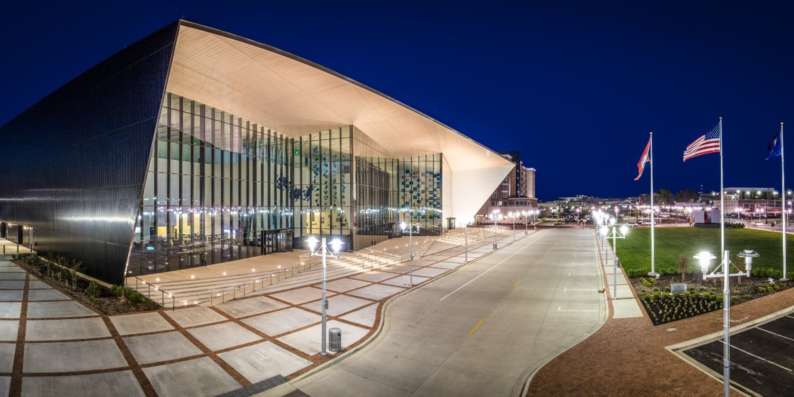

# owensboro-riverfront-change
A look into the changes to the downtown and riverfront area of Owensboro, KY between 2013 and 2022.
# Downtown and Riverfront in Owensboro, KY
## Continued Development and Restoration of a Historic Area

The downtown and riverfront districts in Owensboro, KY, have been in constant change for almost twenty years. Once the center for commercial and industrial distribution along this stretch of the Ohio River, Owensboro's oldest area had become derelict by the turn of the 21st century. Thus, a large effort to revitalize this part of town has been underway since the early 2000's. 

     
*This map shows overlayed LIDAR point clouds collected in two phases across the region in 2013 and 2022. The differences between the data are represented as different colors.*

[High-Resolution PDF](OboroRiverFrontChanges.pdf)     

### What is the floating platform in the foreground?

Image obtained at owensborocenter.com
*The Owensboro Convention center is a uniquely designed building with extreme relief due to the shape of the roof. The surveys conducted by KYFromAbove are aerial, and the LIDAR data they collect is from a vertical perspective. Thus, buildings with no discernible external features, like the Owensboro Convention Center, can appear as floating platforms in a point cloud, which is a phenomenon I wanted to include in my map.*